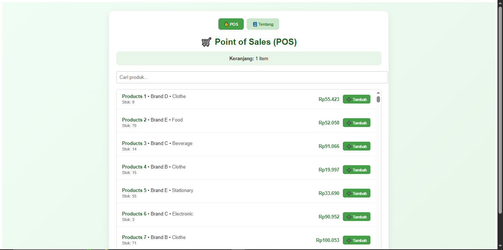
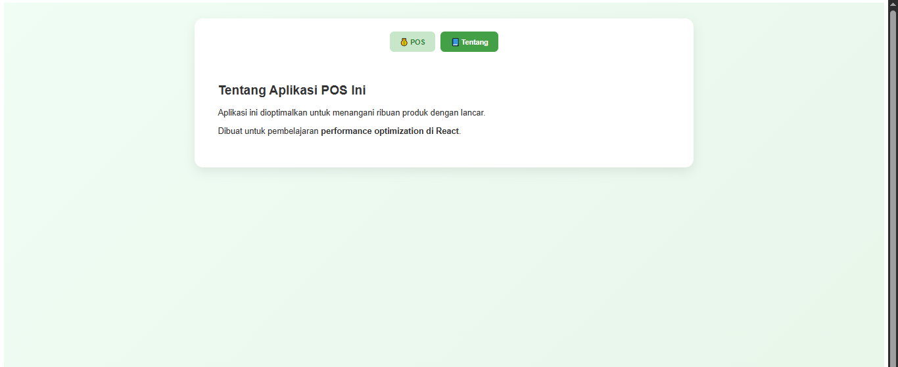
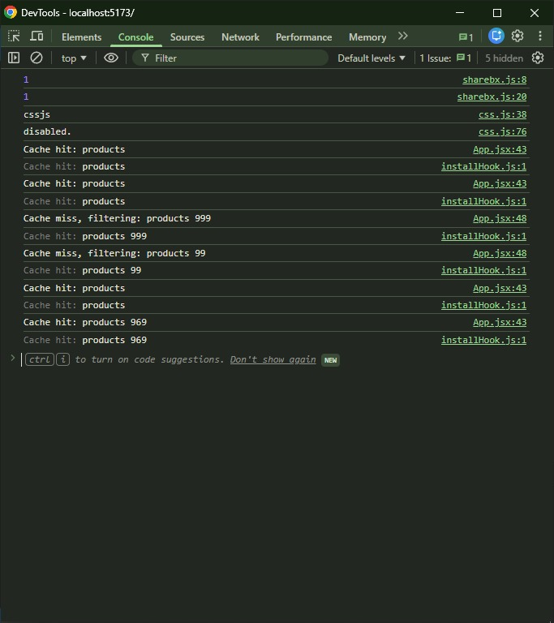

# ⚡ Performance Optimization with React Query – Point of Sales (POS)

## 🧾 Deskripsi
Project ini merupakan hasil praktikum mata kuliah **Pemrograman Web Lanjut** dengan fokus pada **optimasi performa React menggunakan React Query dan teknik caching**.  
Aplikasi ini menampilkan simulasi sederhana **Point of Sales (POS)** dengan fitur pencarian produk, caching, dan keranjang belanja.

## 🚀 Fitur Utama
- 🔎 **Pencarian produk cepat** dengan cache otomatis
- 💾 **Caching manual (localStorage)** dan **caching otomatis (React Query)**
- 🛒 **Keranjang belanja (cart)** tersimpan di localStorage
- 🧠 **Perbandingan performa** sebelum dan sesudah menggunakan React Query

## 📸 Tampilan

  
  



## 🧰 Teknologi yang Digunakan
- **React 18 + Vite**
- **React Query**
- **React Window (Virtual List)**
- **LocalStorage API**
- **DevTools Network & Profiler** untuk pengujian performa

## ⚙️ Instalasi dan Cara Menjalankan
1. Clone repository:
   ```bash
   git clone https://github.com/Yogiexc/React-Performance-Lab.git
Masuk ke folder project:

bash
Copy code
cd React-Performance-Lab
Install dependency:

bash
Copy code
npm install
Jalankan project:

bash
Copy code
npm run dev
🧩 Branch Struktur
main → versi awal tanpa React Query (manual cache)

react-query → versi optimasi dengan React Query

🔬 Analisis Performansi
Kondisi	Waktu Response	Catatan
Tanpa React Query	~180ms	Data difilter manual setiap input
Dengan React Query	~15–30ms	Cache otomatis diakses dari memory

🧠 Penjelasan React Query
React Query secara otomatis:

Menyimpan data hasil fetch dalam cache memory

Mengatur cache invalidation (menentukan kapan data di-refresh)

Memperbarui UI secara otomatis saat data berubah

Menghindari refetch yang berulang dengan sistem key

🏆 Keuntungan Menggunakan Library dibanding Custom Cache
Aspek	Custom Cache	React Query
Implementasi	Manual & rawan bug	Otomatis & terstandar
Cache invalidation	Harus dibuat sendiri	Sudah built-in
Refetch otomatis	Tidak ada	Otomatis
Dukungan DevTools	Tidak ada	Ada (React Query DevTools)
Skalabilitas	Sulit	Mudah diatur

👨‍💻 Author
Bryan Yogie Saputra
Program Studi D3 Teknik Informatika, Universitas Sebelas Maret
📧 Email: bryanyogiesaputra@email.com

📅 Deadline
🗓️ Dikumpulkan paling lambat Senin, 10 November 2025 ke email dosen:
nanang.my@staff.uns.ac.id

yaml
Copy code

---

### **2️⃣ Buat file laporan-react-query.md**

Di root folder, buat file `laporan-react-query.md`:

```markdown
# Laporan React Query – Praktikum Performance Optimization

## 🧠 Perbandingan Waktu Respons
- **Tanpa React Query:** sekitar **150–200 ms** (filter manual setiap input).
- **Dengan React Query:** sekitar **20–40 ms** (cache otomatis digunakan).
- Pengujian dilakukan menggunakan **DevTools → Network dan Profiler tab**.

## 📸 Screenshot DevTools (Cache Hit)


## 💡 Penjelasan
React Query mengelola cache secara **otomatis di memori** dan hanya melakukan **refetch** bila data dianggap kadaluarsa atau invalid.  
Saat pengguna melakukan pencarian yang sama, React Query akan **menampilkan hasil langsung dari cache**, sehingga **waktu respons menjadi sangat cepat**.

## 🤔 Apakah Cache atau LocalStorage Membuat Aplikasi Lebih Baik?
✅ **Ya, sangat membantu.**  
Cache (baik manual maupun dari React Query) membuat aplikasi:
- Menghemat waktu load
- Mengurangi permintaan fetch berulang
- Membuat pengalaman pengguna lebih lancar

Namun, **React Query lebih unggul** karena:
- Cache otomatis disegarkan saat dibutuhkan
- Tidak perlu mengatur validasi atau penyimpanan secara manual
- Integrasi dengan DevTools untuk debugging mudah

## 🧩 Kesimpulan
Penggunaan React Query memberikan peningkatan performa signifikan dibanding cache manual.  
Aplikasi menjadi **lebih efisien, modern, dan scalable**, sesuai praktik terbaik industri web modern.

---

**Disusun oleh:**  
👨‍💻 Bryan Yogie Saputra  
<<<<<<< HEAD
📚 D3 Teknik Informatika – Universitas Sebelas Maret
=======
📚 D3 Teknik Informatika – Universitas Sebelas Maret
>>>>>>> 8acb77a516810e64bfbba92f37e0062f3fb2546d
