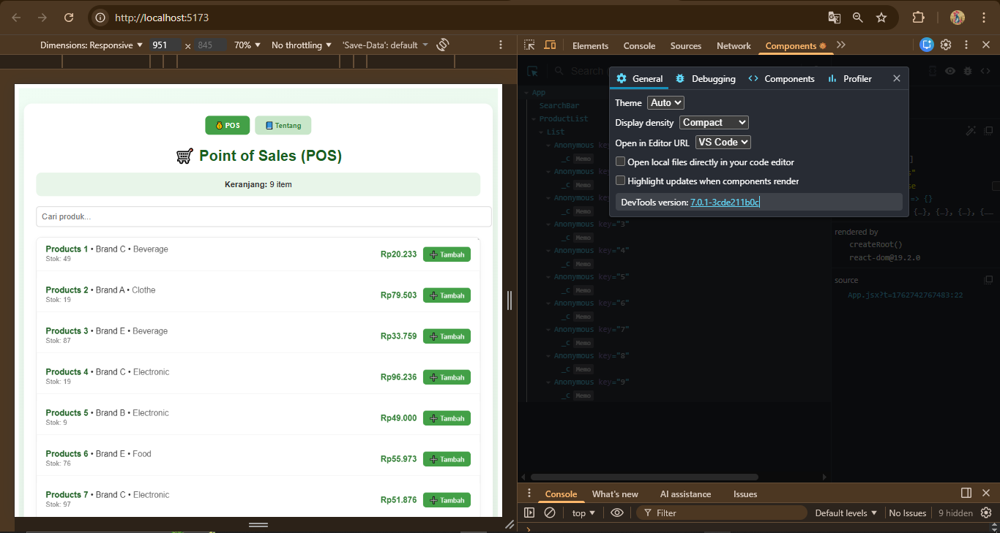
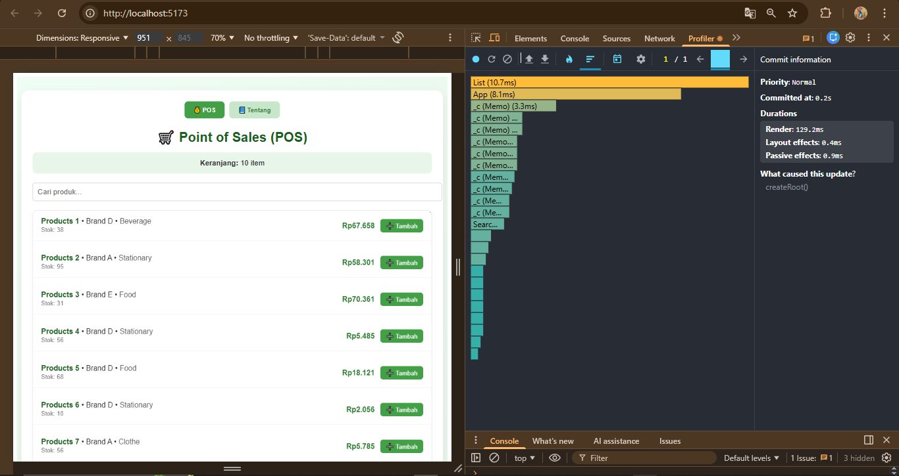
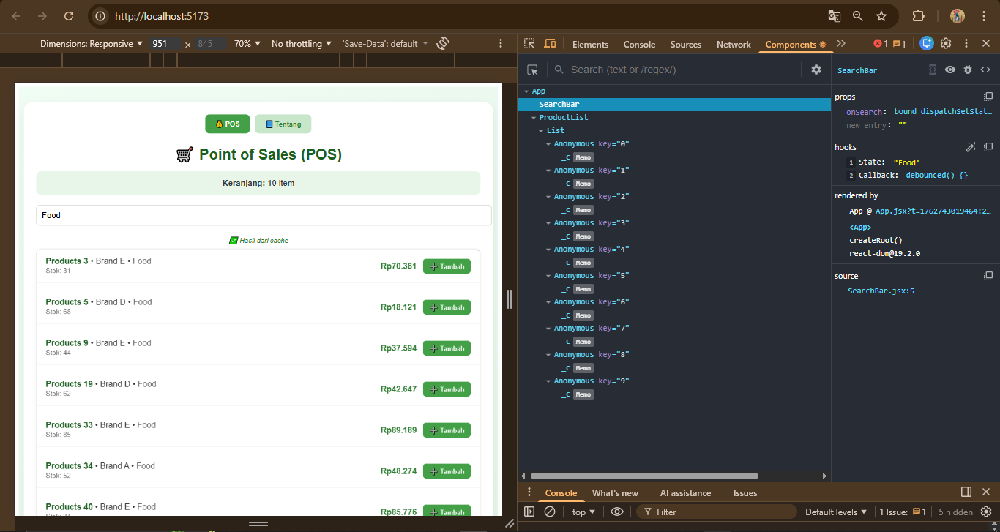

# 📊 Laporan Implementasi React Query
## Implementasi React Query pada Aplikasi POS

### 🧩 Perbandingan Sebelum dan Sesudah React Query

#### 🔴 Sebelum React Query:
- Filter pencarian dilakukan secara **manual** menggunakan custom cache.
- **State management** untuk data produk dan cache dikelola manual di komponen.
- Tidak ada **background refetching** atau **automatic retry**.
- Cache hanya tersimpan sementara di **session** atau **localStorage**.

#### 🟢 Setelah React Query:
- Cache dikelola otomatis dengan **stale-while-revalidate** pattern.
- **Background updating** berjalan tanpa menghambat UI.
- **Automatic retry** pada request yang gagal.
- **Deduplication** mencegah permintaan data yang sama berulang.

---

## ⚙️ Cara React Query Mengelola Cache

React Query menggunakan sistem cache yang **cerdas dan efisien**, dengan fitur-fitur utama berikut:

| Fitur | Penjelasan |
|-------|-------------|
| **Automatic Caching** | Setiap query disimpan dalam cache dengan key unik (`queryKey`) |
| **Stale Time** | Menentukan berapa lama data dianggap fresh sebelum refetch |
| **Cache Time** | Menentukan berapa lama data bertahan di cache setelah komponen unmount |
| **Background Updates** | Melakukan refetch otomatis ketika window refocus |
| **Garbage Collection** | Menghapus cache yang tidak terpakai untuk efisiensi memori |

---

## ⚖️ Keuntungan Menggunakan Library vs Custom Cache

### ✅ Keunggulan React Query:
- **Zero Configuration:** Cache bekerja otomatis tanpa setup rumit.  
- **Error Handling:** Mendukung **automatic retry** dengan exponential backoff.  
- **DevTools Support:** Ada **React Query DevTools** untuk memantau cache dan query.  
- **Type Safety:** Dukungan kuat untuk TypeScript (jika digunakan).  
- **Active Community:** Dokumentasi lengkap dan komunitas luas.

### ❌ Kekurangan Custom Cache:
- Harus menangani semua edge cases secara manual.  
- Risiko **memory leaks** dan **inconsistent state** tinggi.  
- Tidak ada built-in optimization.  
- Perlu waktu lebih banyak untuk maintenance.

---

## 🧠 Screenshot DevTools – Cache Hit

### Analisis Cache Hit:
- Query dengan key `['products']` menunjukkan status **fresh** tanpa loading ulang.
- Data langsung muncul dari **cache memory** tanpa melakukan network request.
- React Query melakukan **background update** tanpa mengganggu pengguna.

---

## ⚡ Pengaruh Cache terhadap Performa Aplikasi

### 🚀 React Query Cache:
✅ Meningkatkan performa secara signifikan karena:
- **Instant loading** untuk data yang sudah di-cache.
- Mengurangi jumlah **API calls redundant**.
- **Smart background updates** menjaga data tetap fresh.
- Mengoptimalkan **re-render** hanya saat data berubah.

### 💾 localStorage:
✅ Tetap membantu user experience karena:
- Data tersimpan **persisten** antar sesi browser.
- Bisa diakses **offline** untuk data yang pernah di-cache.
- Mengurangi waktu load awal (initial load time).

---

## 🧩 Kesimpulan

Penggunaan **React Query** secara dramatis meningkatkan performa aplikasi POS, terutama dalam hal:
- **Responsivitas UI**
- **Efisiensi data fetching**
- **Penghematan resource jaringan**

React Query memberikan solusi caching yang:
- **Superior dibanding custom cache**
- **Mudah di-maintain**
- **Menghadirkan developer experience modern dan efisien**

---

**Disusun oleh:**  
👨‍💻 **Bryan Yogie Saputra**  
📚 D3 Teknik Informatika – Universitas Sebelas Maret  
📅 2025
